# 8-Bit 250-MS/s Differential Current-Steering DAC in 0.18 µm CMOS

Yi-Hsiang Wei and Zijian Shang  
Department of Electrical Engineering, Columbia University  
ELEN E6316 Analog-Digital Interface, Spring 2026

## Abstract

This report presents the design of an 8-bit, 250-MS/s digital-to-analog converter implemented in TSMC 0.18 µm CMOS technology with a 1.8 V supply. A binary-weighted current-steering architecture is adopted, consisting of eight binary-weighted NMOS bit cells with weights 1 through 128, a NAND-latch-based input retimer, a 100 uA NMOS-mirror bias generator, and a per-bit 6-bit analog weight trim DAC for mismatch correction.

The differential output achieves a 1.50 V peak-to-peak swing across a 100 ohm differential / 25 ohm common-mode load. Across TT, SS, and FF process corners, the design achieves a minimum SFDR of 48.2 dB across the tested Nyquist-band input frequencies, meeting the 48 dB SFDR requirement. The design also achieves DNL below 0.18 LSB and INL below 0.24 LSB, well within the +/-1 LSB and +/-2 LSB limits. The 6-bit trim DAC provides approximately -14.8% to +14.3% current tuning range per bit, exceeding the +/-10% specification.

## I. Introduction

High-speed digital-to-analog converters are fundamental building blocks in communication systems, arbitrary waveform generators, and software-defined radio front ends. The purpose of this project is to design an 8-bit DAC at 250-MS/s in TSMC 0.18 µm CMOS.

The design specifications are summarized below.

| Parameter | Requirement | Unit |
| --- | ---: | --- |
| Supply voltage | 1.8 | V |
| Sample rate | 250 | MS/s |
| Resolution | 8 | bits |
| Output type | Differential | - |
| Output swing | >= 1.5 | Vpp,diff |
| SFDR | > 48 | dB |
| Differential output resistance | 100 | ohm |
| Common-mode output resistance | 25 | ohm |
| Load capacitance | 550 | fF per output |
| DNL | < +/-1 | LSB |
| INL | < +/-2 | LSB |
| Weight tuning range | +/-10 | %/bit |
| Reference current | 100 | uA |

## II. Architecture

### A. Binary-Weighted Current-Steering Architecture

The DAC employs a direct binary-weighted current-steering architecture. Eight NMOS bit cells with binary current weights steer current to either the positive or negative output node based on the corresponding digital input bit.

The full-scale current is:

```text
IFS = Iunit * sum(2^k), k = 0...7 = 255 * Iunit
```

For a 1.5 Vpp differential swing across the 100 ohm differential load, each side presents a 50 ohm path to `vdd!`. The required unit current is approximately:

```text
Iunit = 0.75 V / (255 * 50 ohm) ~= 58.8 uA
```

A binary-weighted topology was chosen over a segmented architecture because it requires only 8 active cells and no thermometer decoder, reducing digital complexity and routing congestion.

### B. Analog Weight Tuning

Device mismatch causes the actual current of each bit cell to deviate from its ideal binary weight, degrading INL and DNL. Each bit cell therefore incorporates an independent 6-bit trim DAC that provides a programmable sink current at the internal drain node.

Trim code `32` is defined as the nominal setting. Sweeping the trim code below or above 32 provides effective negative or positive correction relative to the nominal bit-cell current, with a tuning range exceeding +/-10% of the nominal cell current.

### C. Output Network

The differential output is terminated with two 50 ohm resistors, each connected from `vdd!` to the corresponding output node (`OUTp` and `OUTn`), plus 550 fF capacitors from each output node to ground. This configuration gives:

- 100 ohm differential output resistance,
- 25 ohm common-mode output resistance,
- approximately 1.42 V output common-mode voltage.

## III. Building Blocks

### A. Top-Level Design

The top-level design contains four main blocks:

- Bias Generator
- Input Retimer
- DAC Core
- Output Load

The DAC core contains eight binary-weighted bit cells and a per-bit 6-bit trim DAC. The output load is 50 ohm plus 550 fF per output node.

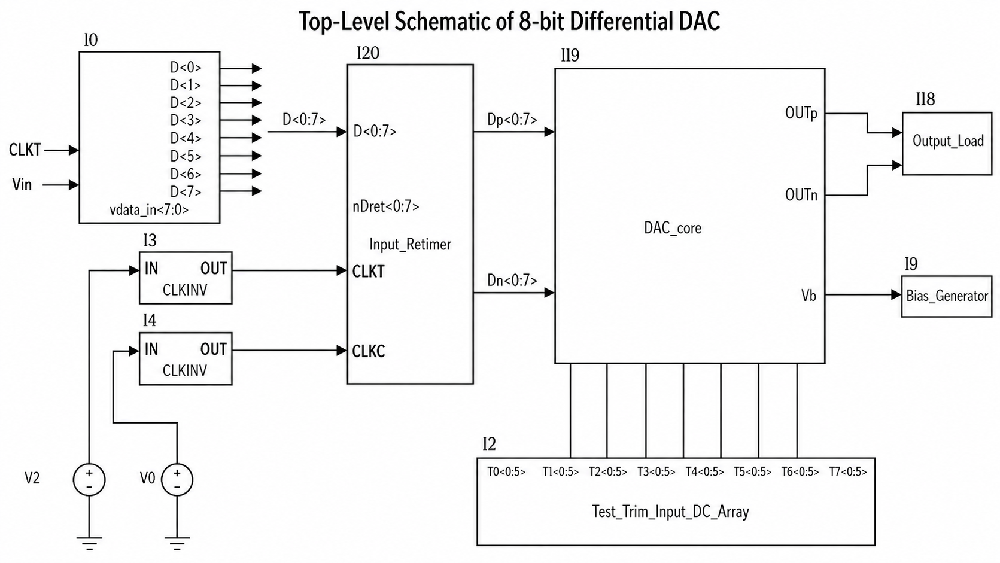

### B. Single Bit Cell of DAC Core

The DAC core uses eight bit cells with weights `1, 2, 4, 8, 16, 32, 64, 128`, corresponding to the 8-bit input code from LSB to MSB. Each bit cell steers its weighted current to either the positive or negative output branch according to the retimed differential digital inputs.

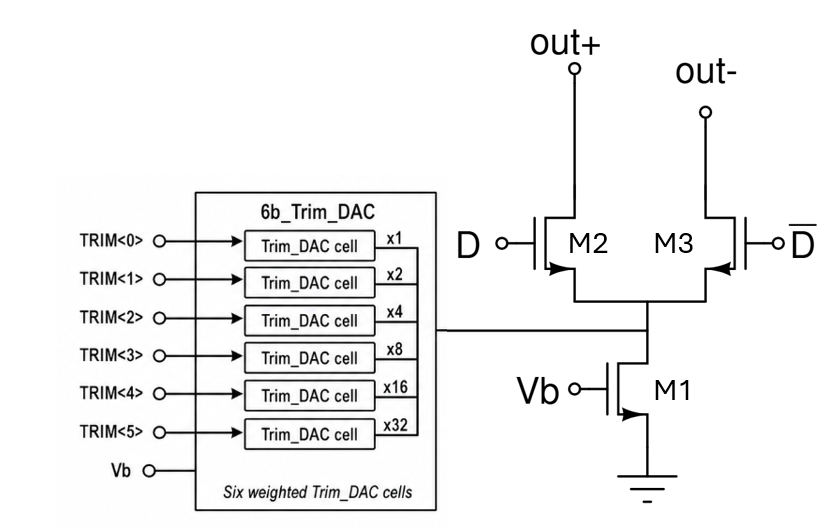

| Device | W | L | Multiplier |
| --- | ---: | ---: | --- |
| Current source | 1.183 um | 500 nm | weight |
| Switch P-side | 500 nm | 180 nm | weight |
| Switch N-side | 500 nm | 180 nm | weight |

For bit `k`, the multiplier is `m = 2^k`; the MSB cell uses `m = 128`, while the LSB cell uses `m = 1`.

### C. Trim DAC Cell

Each bit cell incorporates a 6-bit trim DAC block consisting of six binary-weighted single-bit trim DAC cells with weights `1, 2, 4, 8, 16, 32` times the bit cell base multiplicity.

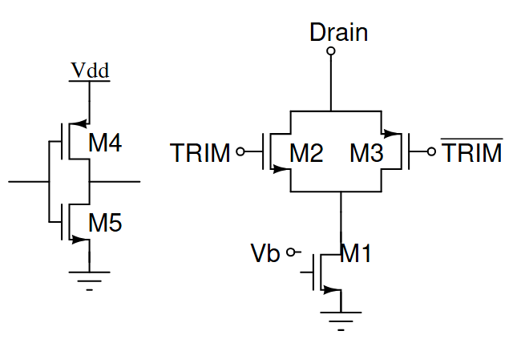

| Device | W | L | Multiplier |
| --- | ---: | ---: | --- |
| Trim source | 220 nm | 20 um | weight |
| Gate PMOS | 4.5 um | 180 nm | 2 |
| Gate NMOS | 4.5 um | 180 nm | 1 |
| Inverter PMOS | 10 um | 180 nm | 1 |
| Inverter NMOS | 10 um | 180 nm | 1 |

The long-channel trim current source improves output impedance and helps keep correction current code-independent. The default trim signal is `100000` in binary, or decimal `32`.

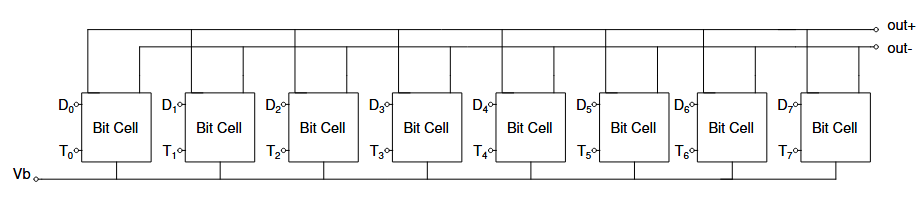

### D. Input Retimer

To ensure simultaneous current-cell switching and suppress inter-bit skew, all 8 data bits are retimed to the rising edge of `CLKT`. Each bit passes through a NAND-latch-based retimer cell that produces synchronous complementary outputs `Dp` and `Dn`.

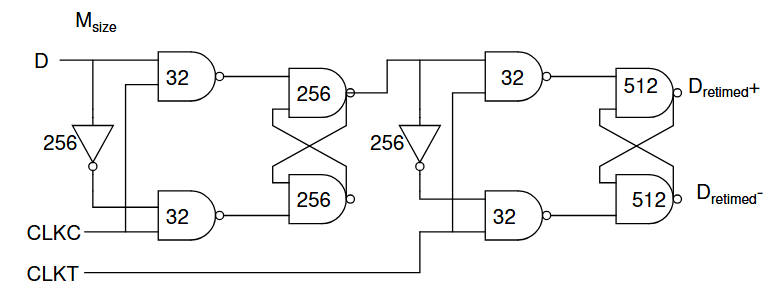

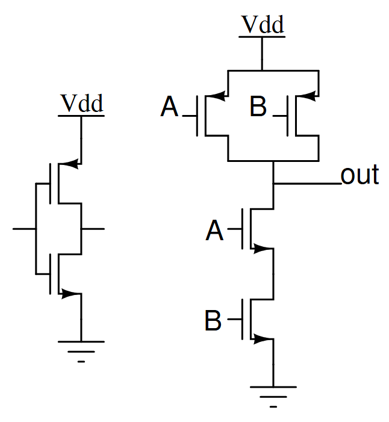

| Device | W | L | Multiplier |
| --- | ---: | ---: | --- |
| NAND PMOS | 220 nm | 180 nm | `2*Msize` |
| NAND NMOS | 220 nm | 180 nm | `2*Msize` |
| Inverter PMOS | 220 nm | 180 nm | `2*Msize` |
| Inverter NMOS | 220 nm | 180 nm | `Msize` |

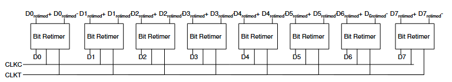

### E. Bias Generator

All current sources share a common gate bias `Vb`, generated by forcing 100 uA through a diode-connected NMOS transistor.

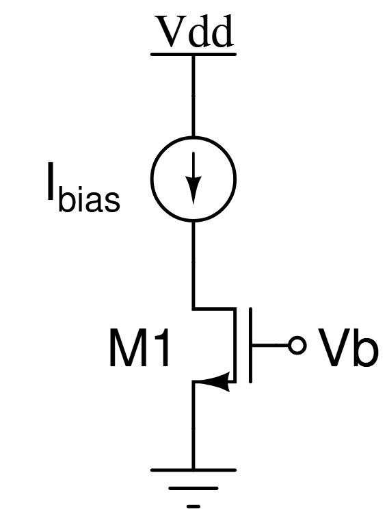

| Parameter | Value |
| --- | ---: |
| Bias current | 100 uA |
| Supply | 1.8 V |
| NMOS width | 3.5 um |
| NMOS length | 800 nm |
| Multiplier | 1 |

## IV. Simulation Results

### A. Simulation Setup

Static linearity is evaluated by sweeping all 256 digital codes in a DC parametric simulation and recording the differential output voltage and single-ended outputs. DNL and INL are calculated from the differential output voltage:

```text
DNL[k] = (Vdiff[k+1] - Vdiff[k]) / LSB - 1
INL[k] = (Vdiff[k] - Videal[k]) / LSB
```

Dynamic performance is evaluated using six coherent input tones with `M = 2048` samples and `J = 17, 127, 251, 503, 751, 997`, where:

```text
fin = J * fs / M
```

The exported output spectrum is post-processed with zero-order-hold sinc correction before calculating SFDR, SNDR, and ENOB. DC bins and the fundamental +/-2 bins are excluded when identifying the largest spur, while the fundamental power is integrated over +/-2 bins for SNDR and SFDR calculation.

### B. Output Impedance

The output impedance is characterized by an AC frequency sweep at each of the `2^8 = 256` input codes. The low-frequency output resistance is extracted for both differential and common-mode outputs.

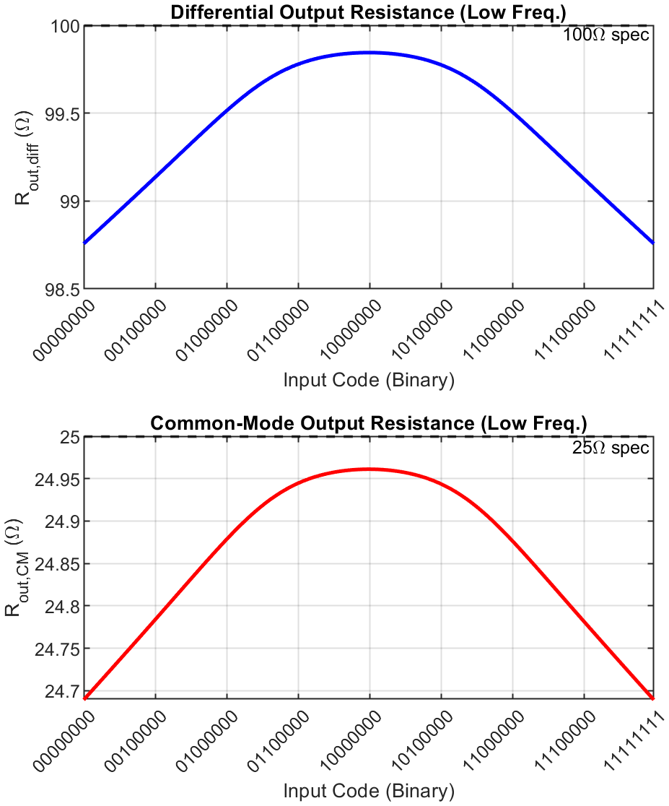

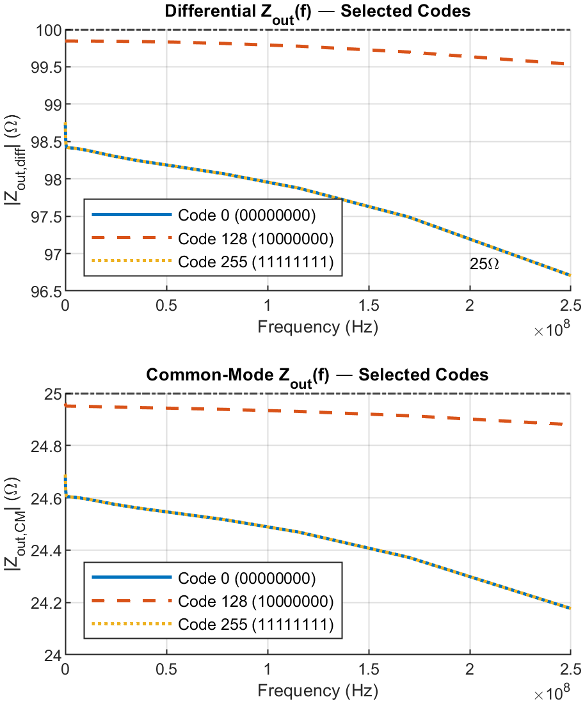

The differential output resistance varies only from 98.76 ohm to 99.84 ohm across all 256 codes. The common-mode resistance varies from 24.69 ohm to 24.96 ohm. Both values are within approximately 1.3% of their respective 100 ohm and 25 ohm targets.

### C. Output Swing and Common-Mode Voltage

All corners achieve at least 1.50 Vpp differential output swing. The common-mode voltage is approximately 1.42 V.

| Corner | Vdiff,pp (V) | VOUTp,pp (V) | VOUTn,pp (V) | VCM (V) |
| --- | ---: | ---: | ---: | ---: |
| SS | 1.501 | 0.751 | 0.751 | 1.424 |
| TT | 1.502 | 0.751 | 0.751 | 1.423 |
| FF | 1.501 | 0.750 | 0.750 | 1.423 |

### D. Retimer Timing Verification

The input retimer synchronizes all 8 data bits to the rising edge of `CLKT`. The report verifies the input data `D<0>`, the retimed output `Dret<0>`, and both clock phases over a 40 ns window.

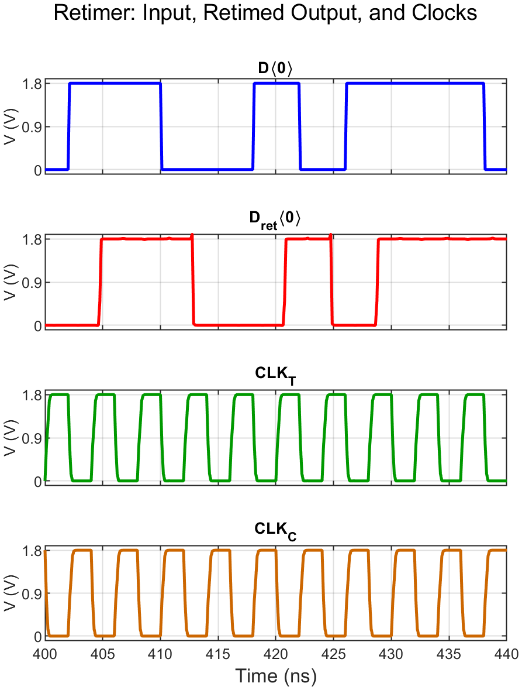

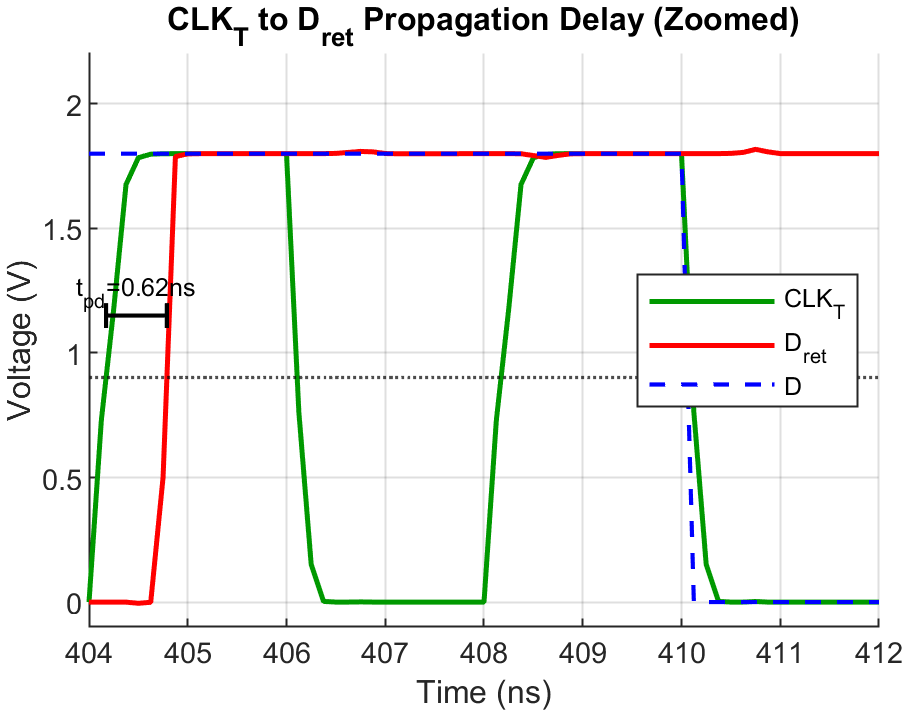

| Parameter | Value |
| --- | ---: |
| `CLKT` to `Dret` rising-edge delay | 0.616 ns |
| `CLKT` to `Dret` falling-edge delay | 0.644 ns |
| Average propagation delay | 0.627 ns |
| Delay as fraction of 4 ns clock period | 15.7% |
| `Dret` rise slew | 7.63 V/ns |
| `Dret` fall slew | 14.90 V/ns |

The average propagation delay is 15.7% of the 4 ns clock period, leaving margin for current-cell switching.

### E. Static Linearity: INL and DNL

| Corner | DNL min (LSB) | DNL max (LSB) | INL min (LSB) | INL max (LSB) |
| --- | ---: | ---: | ---: | ---: |
| SS | -0.172 | +0.002 | -0.086 | +0.086 |
| TT | -0.026 | +0.003 | -0.159 | +0.159 |
| FF | -0.012 | +0.005 | -0.235 | +0.235 |
| Requirement | > -1 | < +1 | > -2 | < +2 |

All corners are within the +/-1 LSB DNL and +/-2 LSB INL requirements. The peak INL magnitude is 0.235 LSB in the FF corner.

### F. Analog Weight Tuning Range

Per-bit current deviation is measured as the 6-bit trim code is swept from 0 to 63, using trim code 32 as the reference.

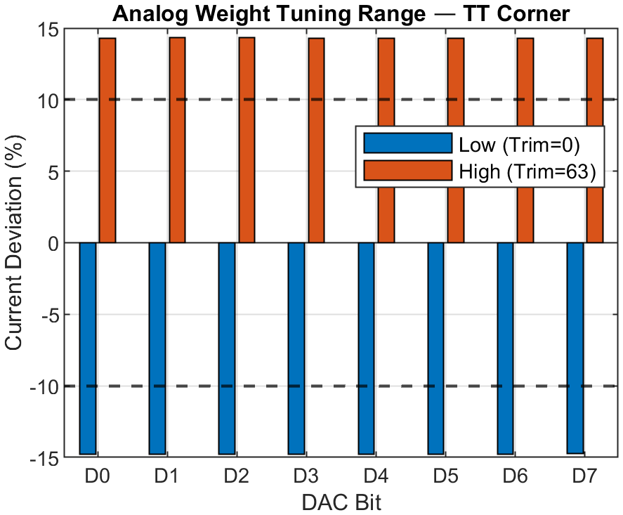

The measured tuning range is -14.8% at trim code 0 to +14.3% at trim code 63, averaged across all 8 bits. This exceeds the +/-10% requirement with more than 40% margin.

### G. Dynamic Performance

Output spectra are measured at low input frequency and near Nyquist. The TT corner examples are:

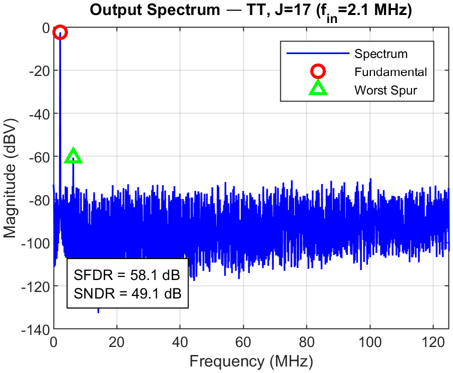

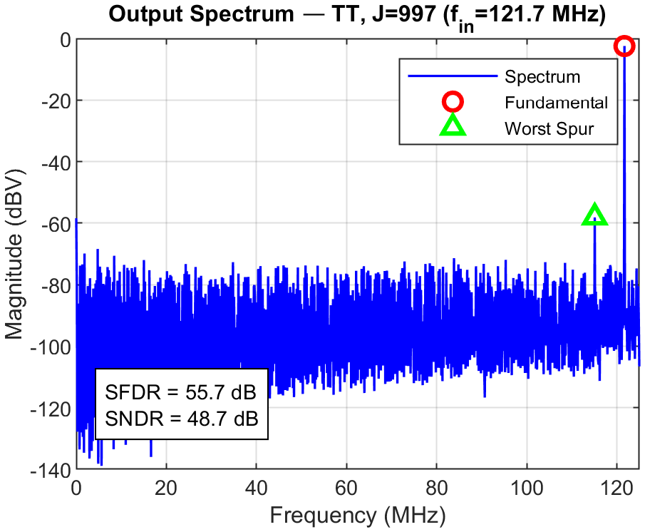

SFDR and SNDR across process corners:

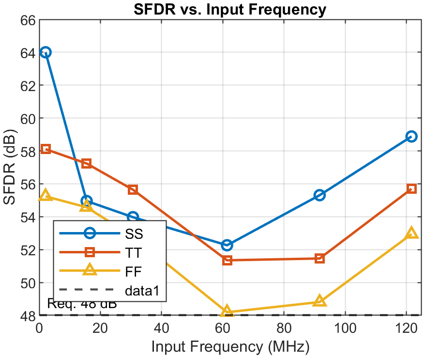

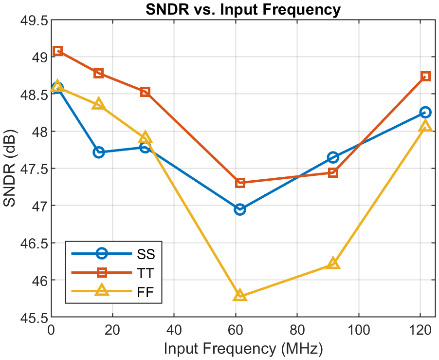

The TT corner achieves SFDR from 51 dB to 58 dB and SNDR from 47 dB to 49 dB across the tested Nyquist-band tones. The FF corner has the worst SFDR, dropping to 48.2 dB near 61 MHz.

### H. Performance Summary

| Parameter | SS | TT | FF |
| --- | ---: | ---: | ---: |
| Vdiff,pp (V) | 1.501 | 1.502 | 1.501 |
| VCM (V) | 1.424 | 1.423 | 1.423 |
| DNL peak (LSB) | -0.172 | -0.026 | -0.012 |
| INL peak (LSB) | +/-0.086 | +/-0.159 | +/-0.235 |
| SFDR at fin = 2.1 MHz (dB) | 64.0 | 58.1 | 55.2 |
| SFDR at fin = 121.7 MHz (dB) | 58.9 | 55.7 | 52.9 |
| Minimum SFDR across tested Nyquist band (dB) | 52.3 | 51.4 | 48.2 |
| SNDR at fin = 2.1 MHz (dB) | 48.6 | 49.1 | 48.6 |
| SNDR at fin = 121.7 MHz (dB) | 48.3 | 48.7 | 48.1 |
| ENOB at fin = 2.1 MHz (bits) | 7.78 | 7.86 | 7.78 |
| ENOB at fin = 121.7 MHz (bits) | 7.72 | 7.80 | 7.69 |

Additional summary values:

| Parameter | Value |
| --- | ---: |
| Differential output resistance range | 98.76-99.84 ohm |
| Common-mode output resistance range | 24.69-24.96 ohm |
| Trim tuning range | -14.8% to +14.3% |
| Retimer power at 2.1 MHz | 20.9 mW |
| Retimer power at 121.7 MHz | 30.6 mW |
| DAC + load power | approximately 30.0 mW |
| Bias generator power | 0.18 mW |
| Total power at 2.1 MHz | 51.0 mW |
| Total power at 121.7 MHz | 60.8 mW |

### I. Power Consumption

Power is measured by time-averaging instantaneous supply power from 10 ns to 990 ns in transient simulation at three representative input frequencies in the TT corner.

| Block | Low, 2.1 MHz | Mid, 61.4 MHz | High, 121.7 MHz |
| --- | ---: | ---: | ---: |
| Retimer | 20.85 mW | 26.41 mW | 30.59 mW |
| Bias generator | 0.18 mW | 0.18 mW | 0.18 mW |
| DAC + Load | 29.93 mW | 29.98 mW | 30.02 mW |
| Total | 50.96 mW | 56.57 mW | 60.79 mW |

The DAC core and load consume nearly constant power across input frequency. The retimer is the dominant frequency-dependent block.

### J. SFDR Limiting Factors

The primary SFDR bottleneck is switching nonlinearity in the high-weight current cells. The MSB cell carries 128 LSBs of current and uses 128 parallel switch transistors. The large gate capacitance of these wide devices causes code-dependent charge injection and finite rise/fall time at the switch drains, producing harmonic distortion.

The FF corner has faster transitions and stronger switching transients, which can worsen dynamic distortion. The minimum SFDR of 48.2 dB occurs in the FF corner near 61 MHz. The NAND-latch retimer suppresses HD2 by ensuring `Dp` and `Dn` switch symmetrically, but odd-order harmonics remain and ultimately limit SFDR.

## V. Conclusion

An 8-bit, 250-MS/s differential current-steering DAC was designed in TSMC 0.18 µm CMOS. The design meets all static specifications: differential output swing of 1.50 Vpp, DNL below 0.18 LSB, and INL below 0.24 LSB across TT, SS, and FF corners. The 6-bit analog weight trim DAC provides approximately +/-14% tuning range per bit, exceeding the +/-10% requirement.

Dynamic performance satisfies the 48 dB SFDR target across the tested Nyquist-band input frequencies, with the tightest margin in the FF corner at mid-frequency. The output impedance meets specification across all 256 input codes: differential output resistance is 98.76-99.84 ohm and common-mode output resistance is 24.69-24.96 ohm. Total power ranges from 51.0 mW at low input frequency to 60.8 mW near Nyquist, with the retimer as the dominant frequency-dependent consumer.
